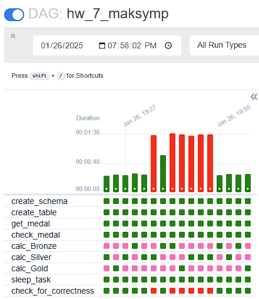
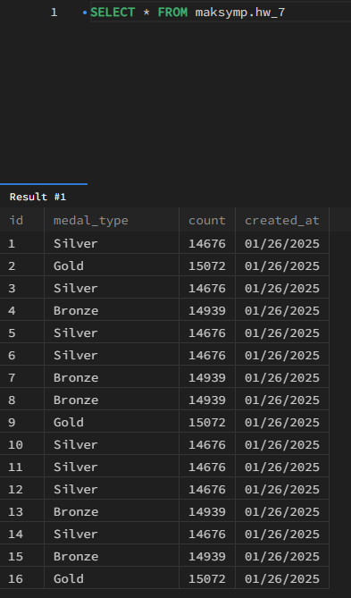

## Домашнє завдання до теми “Apache Airflow”

### Виконання DAG'у в Airflow з короткою та довгою затримками

***Noate**: на графіку статусу виконання дагу видно, що маємо одне вдале виконання поміж двома невдалими, це відбулося через те, що було запущено 2 таски паралельно. Відповідно, одна таска "побачила" оновлення бази даних другою таскою.*

### Записи в базі даних `maksymp.hw_7`

